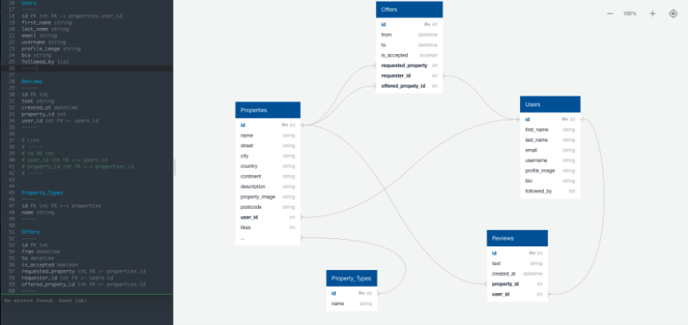
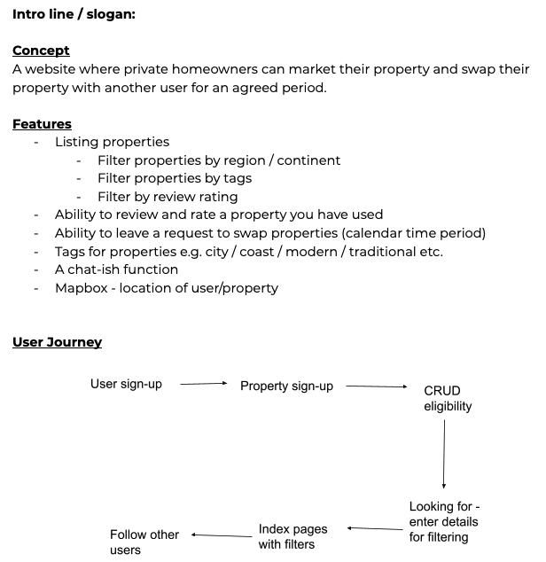
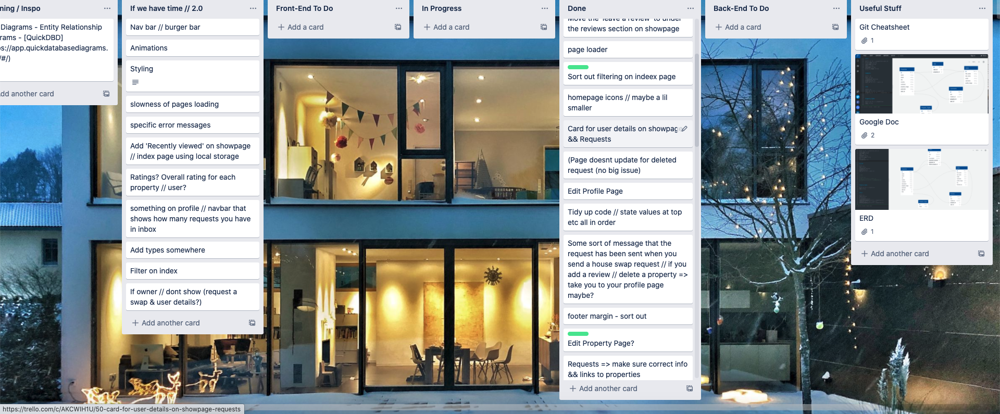
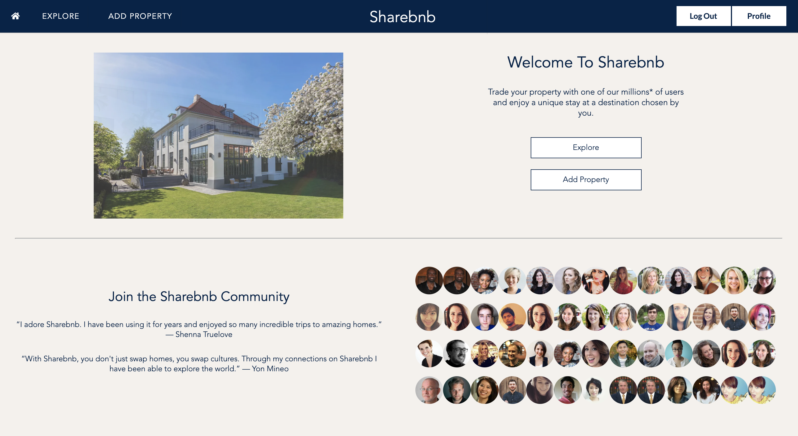
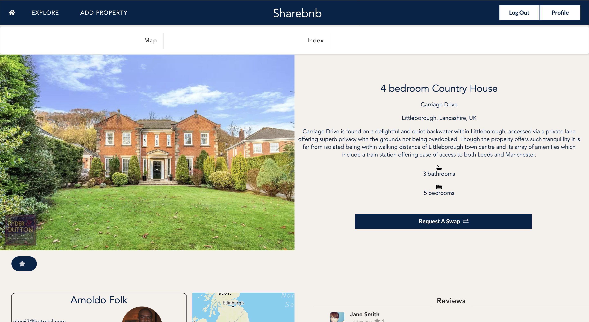
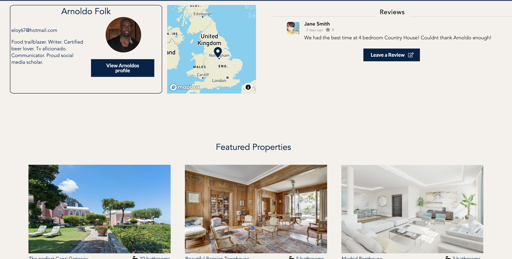
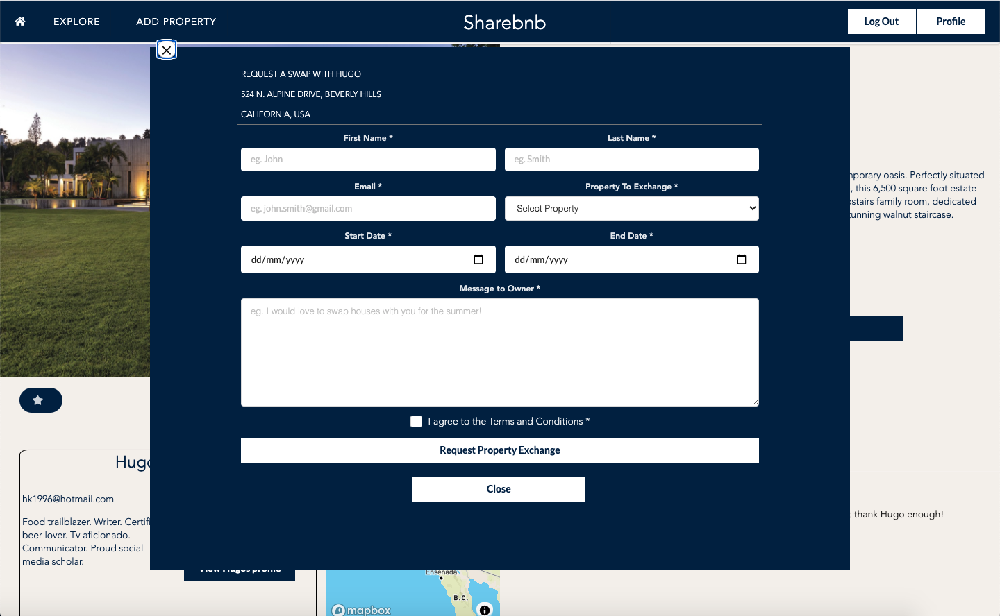

#  Project #4: Sharebnb 

# Brief
Create a full stack application using a Python Django REST Framework Backend to serve data from a Postgres Database and a React Frontend. Time period: 1 week. Pair project.

# Members

- Elsie Down - https://github.com/elsiedown
- Hugo Kinahan - https://github.com/hugokinahan

# Deployment

Please follow the link to the website: https://share-bnb.herokuapp.com/

Repository link: https://github.com/hugokinahan/sei-project-4

# Motivation
As a pair we decided on a house swap website, where users would register their own property to search for another property to swap with. 

Our end product was Sharebnb, a clean, upmarket house swap website with social fucntionality and interconnectivity. All user data was created at random using external websites while property seed data was created by us. 

# Preparation & Organisation

ERD Diagram



Wireframe



Trello



# Frameworks used

- HTML5
- SCSS
  - SemanticUI
- Python
  - Django
- JavaScript
  -  ECMAScript6
  - React.js
- mySQL
  - PostgreSQL
- GitHub
- Insomnia

# Process

Having learnt from a past pair project, we spent a good amount of time planning our application, establishing what relationships would be needed, the user journey and how our ideals for the 'look and feel' of the website. We established our relationships on an ERD Diagram you can see above and gauged a rough user journey. 

After only one week of Python and Django tuition under our belt, we decided to set ourselves a challenging 

# Screenshots

Homepage



Index Page


Show Page



Show Page



# Challenges

This was my first project using a Python Django backend, so I faced a lot of challenges throughout my time working on the backend. 

The most challenging element when implementing the backend was understanding the relationships (one to many or many to many) and how to create these relationships within serializers. 

For example, we had many relationships to handle at once, especially those related to the user. Below you can see our PopulatedUserSerializer which containers 5 different relationships embedded. 

```
class PopulatedUserSerializer(UserSerializer):

    created_property = PopulatedPropertySerializer(many=True)
    posted_reviews = ReviewSerializer(many=True)
    favorited_property = PropertySerializer(many=True)
    followed_user = UserSerializer(many=True)  
    posted_offers = PopulatedOfferSerializer(many=True)
```

The challenging element of this was staying on top of these relationships as we added extra features like favouriting properties and following other users. Understanding where they needed to be used was key to the fluidity of the application. 

# Wins

Throughout our project we worked hard to give the website a clean and 'upmarket' finish. One aspect of this was maintaining a fluid user journey throughout their navigation of the site. 

To stop users from having to change pages to often I implemented popup modals from React.js-popup. This meant that the user could stay on the same page when making requests. These requests included leavving a review and a rating as well as making a request for a house swap. 

The below code snippet shows how we implemented these popup modals (some code from the form has been ommitted to save space) and the screenshot shows this popup modal in action.


```
    <Popup
      trigger={<Button className="request-button" type="submit" style={{ backgroundColor: '#012349', borderRadius: 0, color: 'white' }}>
        Request A Swap <Icon name="exchange" className="exchange-icon"/>
      </Button>}
      modal
      nested
    >
      {close => (
        <div className={!isSent ?  'modal' : 'sent-modal'}>
          <button className="close" onClick={close}>
          &times;
          </button>
          <div className="header"> 
            {property.owner ?  
              <div>
                <p>Request a swap with {property.owner.first_name} </p>
                <p>{property.address}</p>
                <p>{property.city}, {property.country}</p>
              </div>
              : '' }
          </div>
          <div className="content">
            {!isSent ?
              <Form inverted onSubmit={handleSubmit} className="small form">
                <Form.Group widths='equal'>
                  <Form.Field>
                    <label fluid>First Name *</label>
                    <input placeholder='eg. John'
                      onChange={handleChange}
                      name="first_name"
                    // value={formdata.first_name}
                    />
                  </Form.Field>
          <div className="actions">
            <Button className="popup-auth-request" onClick={() => {
              console.log('modal closed ')
              close()
            }} style={{ backgroundColor: 'white', borderRadius: 0, color: '#012349', border: 'none', width: '25%' }}>Close</Button>
            
          </div>
        </div>
      )}
    </Popup>
  ```
  
    
   
# Key Learnings


  
# Future Features
If we had more time to complete this project we would have included:

- Dedicated more time to styling
- Mobile Optimisation
- Implemented notifications functionality 


